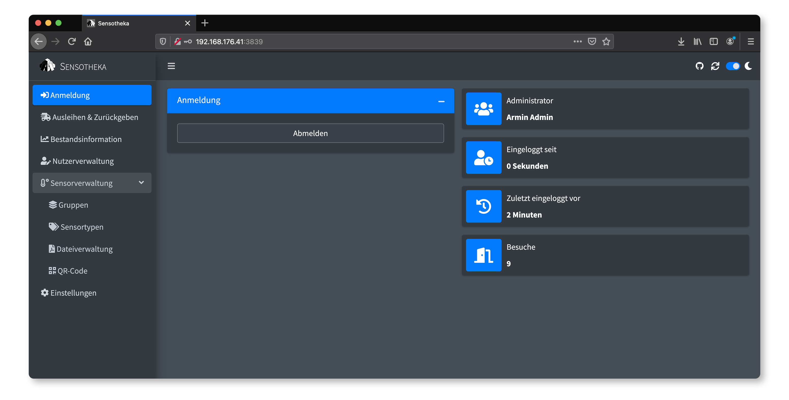

# Umsetzung {#implementation}

Die folgenden Abschnitte stellen die Umsetzung der Web-Applikation sowohl aus der anwendungsorientierten als auch der technikorienten Sichtweise dar.

## Anwendungsorientierte Sichtweise

Die Web-Applikation ist ein Dashboard. Dieses besitzt eine Sidebar, eine Navbar und einen Body.

```{r, echo=FALSE, fig.cap="Übersicht über das Dashboard"}
knitr::include_graphics("./img/app_overview.png")
```

### Sidebar

In der Sidebar kann über einen Reiter die Funktionalität ausgewählt werden, die im Body dargestellt wird. Die Anzahl an Auswahlmöglichkeiten hängt vom Anmeldestatus und Benutzerrolle ab.

### Navbar

Die Navbar enthält:

* einen Link zum GitHub-Repository, das den Quellcode der Web-Applikation enthält,
* einen Reload-Button, mit dem eine Aktualisierung der Daten erzwungen werden kann,
* einen Toggle, mit dem zwischen Tag- und Nachtmodus gewechselt werden kann.

### Anmeldung

Dieser Reiter verändert sich in Abhängigkeit des Anmeldestatus.

#### Status: Nicht angemeldet

```{r, echo=FALSE, fig.cap="Anmeldung - nicht angemeldet"}
knitr::include_graphics("./img/login_mask.png")
```

Registrierte Benutzer können sich durch Angabe ihres Benutzernamens und ihres Passwortes anmelden. Nicht-registrierte Benutzer müssen sich von einem Moderator oder Administrator (Wissenschaftliche Mitarbeiter) registrieren lassen.

#### Status: Angemeldet

```{r, echo=FALSE, fig.cap="Anmeldung - angemeldet"}

```

Nach erfolgreicher Anmeldung wird der Benutzer mit Informationen über sein Nutzungsverhalten versorgt. Dargestellt werden:

* der Benutzername und der Benutzerstatus,
* die Dauer seit der momentanen Anmeldung,
* die Dauer seit der letzten Anmeldung,
* die Anzahl der Anmeldungen.

Benutzer können sich abmelden.

### Ausleihen & Zurückgeben

### Bestandsinformation

### Nutzerverwaltung 

`r badge("admin")`
`r badge("mod")`

### Gruppen 

`r badge("admin")`

### Sensortypen 

`r badge("admin")`

### Dateiverwaltung 

`r badge("admin")`

### QR-Code 

`r badge("admin")`

### Einstellungen

#### Benutzernamen ändern

Um den eigenen Benutzernamen zu ändern, muss ein neuer Benutzername eingeben werden. Nach Eingabe des Passworts und Bestätigen wird der Benutzername geändert.

#### Passwort ändern

Um das eigene Passwort zu ändern, muss ein neues Passwort zweimal eingegeben und bestätigt werden.

## Technikorientierte Sichtweise