---
output:
  bookdown::gitbook:
    css: style.css
    config:
      toc:
        before: |
          <li><a href="./">Sensotheka</a></li>
        after: |
          <li><a href="https://github.com/rstudio/bookdown" target="blank">Published with bookdown</a></li>
      download: ["pdf", "epub"]
      sharing:
          facebook: false
          twitter: false
    pandoc_args: [ "--csl", "thieme-german.csl"]
  bookdown::pdf_book:
    includes:
      in_header: preamble.tex
    keep_tex: yes
    citation_package: biblatex
  bookdown::epub_book: default
bibliography: [book.bib, r-bib.bib]
biblio-style: numeric
link-citations: true
always_allow_html: true
geometry: "left=3cm,right=3.5cm,top=2cm,bottom=2cm"
toc-title: Inhaltsverzeichnis
---

\renewcommand{\figurename}{Abbildung}
\renewcommand{\tablename}{Tabelle}
\renewcommand{\listfigurename}{Abbildungsverzeichnis}
\renewcommand{\listtablename}{Tabellenverzeichnis}
\renewcommand{\refname}{Literaturverzeichnis}

\pagenumbering{Roman}

\newpage{}

\listoffigures
\addcontentsline{toc}{section}{Abbildungsverzeichnis}

\newpage{}

\listoftables
\addcontentsline{toc}{section}{Tabellenverzeichnis}

\newpage{}

\pagenumbering{arabic}

```{r, echo=FALSE}
library(shiny)
library(dplyr)

badge <- function(type = c("admin", "mod", "user", "unique", "nn", "fk"), short = FALSE) {
  type <- match.arg(type)
  
  text <- if (short) {
    switch (
      type,
      "admin" = "A",
      "mod" = "M",
      "user" = "B",
      "unique" = "U",
      "nn" = ">= 0",
      "fk" = "FK"
    )
  } else {
    switch (
      type,
      "admin" = "Administrator",
      "mod" = "Moderator",
      "user" = "Benutzer",
      "unique" = "Einzigartig",
      "nn" = "Nicht-negativ",
      "fk" = "Fremdschlüssel"
    )
  }
  
  if (knitr::is_html_output()) {
    htmltools::span(
      class = paste("badge", type),
      text
    )
  } else {
    text
  }
}

operate_button <- function(operation = c("borrow", "return", "write-off")) {
  operation <- match.arg(operation)
  
  if (knitr::is_html_output()) {
    shiny::actionButton(
    inputId = "",
    label = switch(
      operation,
      "borrow" = "Ausleihen",
      "return" = "Zurückgeben",
      "write-off" = "Abschreiben"
    ),
    icon = shiny::icon(
      name = switch(
        operation,
        "borrow" = "sign-out-alt",
        "return" = "sign-in-alt",
        "write-off" = "balance-scale-right"
      )
    ),
    class = paste0(operation, "-btn"),
    style = "width: 100px; margin-right: 10px;"
  ) %>% htmltools::span()
  }
}
```

# Einführung {#introduction}

Die Verwaltung von Messmitteln am Fachgebiet Fahrzeugantriebe der Technischen Universität Berlin gestaltet sich schwierig. Zurzeit werden Messmittel dezentral verwaltet. Die handelnden Personen besitzen wenig Information über den Ausleihzustand einzelner Messmittel über verschiedene Projekte hinweg. Daher hat sich das Fachgebiet entschlossen, im Rahmen des Moduls "Projekt Fahrzeugantriebe" eine Web-Applikation zur Verwaltung von Messmitteln erstellen zu lassen. Diese Web-Applikation soll die Ausleihe und Rückgabe einzelner Messmittel über einen QR-Code realisieren. Darüber hinaus sollen Messmittel gruppiert, zusätzliche Informationen, wie zum Beispiel Datenblätter für Messmittel, bereitgestellt und der Bestand von Messmitteln erfasst werden. Um die unterschiedlichen Verantwortlichkeiten der Akteure zu berücksichtigen, ist zudem eine rechtebasierte Nutzerverwaltung vorzusehen.

Der Inhalt dieses Berichtes umfasst die Dokumentation des Arbeitsprozesses, die Beschreibung des finalen Produktes hinsichtlich technischer Umsetzung und Funktionalität und zeigt zusätzlich Anknüpfungspunkte für Folgeprojekte auf.

Messmittel = Sensor

<!--chapter:end:index.Rmd-->

# Anforderungen {#requirements}

Aus der vom Fachgebiet bereitgestellten Aufgabenstellung wurden unmittelbar die folgenden Anforderungen abgeleitet: Aufbauend auf einer Literaturrecherche soll ein Konzept zur Erstellung einer Web-Applikation entworfen werden. Die Umsetzung besteht aus der Programmierung der entworfenen Web-Applikation sowie dem Anlegen einer zugehörigen Datenbank auf dem Server des Fachgebiets. Die verwendeten Technologien sind dabei begründet frei zu wählen. Die konkreten Anforderungen an die Web-Applikation sind dabei aus dem in der Aufgabenstellung beschriebenen Funktionstest abgeleitet worden:

* Erstellen von Sensoren
* Erstellen von Nutzern
* Matching unterschiedlicher Sensortypen mit jeweils einem QR-Code
* Ausleihe und Rückgabe von Sensoren
* Konsistente Datenverwaltung in Form einer Datenbank

Diese Anforderungen stellen den minimalen Satz an Anforderungen dar. Während der Bearbeitung des Projektes zeigte sich, dass zusätzliche Anforderungen notwendig sind, um einen zweckmäßigen Einsatz am Fachgebiet sicherzustellen. Die Web-Applikation soll beispielsweise sowohl von Studenten, wissenschaftlichen Mitarbeitern und speziell geschultem Personal (üblicherweise wissenschaftliche Mitarbeiter) mit unterschiedlichen Verantwortlichkeiten genutzt werden. Daher müssen die Minimalanforderungen erweitert werden. Nutzer besitzen unterschiedliche Rechte und müssen sich gegenüber der Web-Applikation authentifizieren. Der finale Satz an Anforderungen kann den folgenden Abschnitten zu funktionalen und nicht-funktionalen Anforderungen entnommen werden.

## Funktionale Anforderungen an die Web-Applikation

Funktionale Anforderungen spiegeln den Funktionsumfang der Web-Applikation wider. Die Vielzahl funktionaler Anforderungen bedingt ein Aufgliedern in verschiedene Funktionsbereiche, die im Folgenden detailliert beschrieben werden.

### Sensorverwaltung

Die Sensoren am Fachgebiet stehen untereinander in Beziehung: Ein Versuchsaufbau kann sich aus verschiedenen Sensoren zusammensetzen. Dabei ist weniger der Sensor als viel mehr seine Art von Interesse. So ist es zum Beispiel unerheblich von welchem Hersteller oder aus welcher Serie ein konkreter Sensor ist, solange die gleiche Funktionalität erbracht wird. Der konkrete Sensor wird als *Untertyp* bezeichnet. Die Funktionalität, die alle *Untertypen* verbindet, spiegelt sich im *Typen* wider. Ein Versuchsaufbau ist schließlich eine *Gruppe*, die verschiedene *Typen* beinhaltet. Zusammenfassend lässt sich festhalten: 

> Jeder Sensor hat einen *Untertypen*. Mehrere nur geringfügig unterschiedliche *Untertypen* werden in einem *Typen* zusammengefasst. Mehrere *Typen* können Teil einer *Gruppe* sein. Ein *Typ* kann Teil mehrerer Gruppen sein.

Ausgehend von diesen Definitionen sind die folgenden Anforderungen zu erfüllen:

* Erstellen und Entfernen von *Gruppen*, *Typen* und *Untertypen*
* Umbenennen von *Gruppen*, *Typen* und *Untertypen* 
* Bestandserfassung auf Ebene der *Untertypen*
* Matching von QR-Codes auf Ebene der *Typen*
* Verknüpfung von *Gruppen* mit *Typen* und von *Typen* mit *Untertypen*

### Dateiverwaltung

* Hochladen, Umbenennen und Löschen von Datenblättern im PDF-Format für *Gruppen*, *Typen* und *Untertypen*
* Herunterladen von einzelnen Datenblättern als PDF-Datei oder mehreren Datenblättern komprimiert in einer zip-Datei 

### Nutzerverwaltung

Wie eingangs beschrieben, ist eine rechtebasierte Verwaltung notwendig. Dazu werden drei Rollen angelegt. Der *Benutzer* kann Sensoren ausleihen und zurückgeben. Er kann seinen Benutzernamen und sein Passwort ändern. Der *Moderator* kann zusätzlich *Benutzer* anlegen. Der *Administrator* kann zusätzlich auf die Sensorverwaltung zugreifen und Nutzer mit einer beliebigen Rolle anlegen. Um ein hohes Maß an Übersichtlichkeit für den Leser zu gewährleisten wurde sich ferner dazu entschieden, Operation, die ausschließlich mit erweiterten Rechten durchführbar sind, mit einem der Rolle entsprechenden Kürzel zu markieren. So sind Operationen, die insbesondere für Administatoren bzw. Moderatoren von Relevanz sind mit `r badge("admin", short = TRUE)` bzw. `r badge("mod", short = TRUE)` gekennzeichnet. Eine genaue Aufschlüsselung der Rechte der drei Rollen - und somit der Anforderungen an die Nutzerverwaltung - kann Tabelle \@ref(tab:user-rights) entnommen werden. 

| Operation | `r badge("admin")` | `r badge("mod")` | `r badge("user")` |
|:------------ | :--: | :--: | :--: |
| Ausleihen & Zurückgeben | x | x | x |
| Erweiterte Bestandsinformation | x | x | |
| Nutzer hinzufügen / löschen | x | x | |
| Moderator hinzufügen / löschen | x | | |
| QR-Code generieren | x | | |
| Sensoren verwalten | x | | |
| Dateien verwalten | x | | |

Table: (\#tab:user-rights) Übersicht über die Nutzerrollen

### Ausleihverwaltung

* Ausleihe und Rückgabe von *Untertypen* beliebiger Menge innerhalb eines verfügbaren Rahmens durch Nutzer oder für beliebigen Nutzer durch *Administrator*
* Abschreiben von *Untertypen* durch *Administratoren*
* Anzeige von Datenblättern für *Gruppen*, *Typen* und *Untertypen*

### Bestandsinformation

Um ohne Betreten des Lagerortes ermitteln zu können, wie viele Elemente eines *Typen* oder *Untertypen* verfügbar sind oder festzustellen, welcher Nutzer einen benötigten *Typen* ausgeliehen hat, ist eine Übersicht über den Bestand und die Ausleihhistorie zu implementieren.

## Nicht-funktionale Anforderungen an die Web-Applikation

Für einen nachhaltigen Einsatz der Web-Applikation sind die folgenden nicht-funktionalen Anforderungen zu erfüllen:

* Intuitive Nutzerführung
* Konsistenz durch wiedererkennbares Layout und Design
* Performance

Aufgrund ihres nicht-funktionalen Charakters ist die Erfüllung nicht an konkrete Bedingungen geknüpft. Alle unternommenen Bestrebungen zur Erfüllung der funktionalen Anforderungen sind stets hinsichtlich der hier aufgeführten nicht-funktionalen Anforderungen zu bewerten.

## Zusätzliche Anforderungen

Zusätzlich soll eine Datenbank für die konsistente Verwaltung der anzulegenden Daten genutzt werden. Die Web-Applikation und die Datenbank sollen auf einer virtuellen Maschine (*VM*), die auf einem Server des Fachgebiets abgelegt wird, betrieben werden.

### Datenbank

Die Datenbank soll die konsistente Datenverwaltung bewerkstelligen. Sie enthält Tabellen, welche entsprechend der funktionalen Anforderungen der Web-Applikation zu gestalten und miteinander zu verknüpfen sind. Hierzu müssen sowohl ein geeignetes Datenbankmodell als auch ein konkretes Datenbankmanagementsystem ausgewählt werden.

### Deployment

Als Deployment wird die Integration der Web-Applikation und der Datenbank in die bestehende Infrastruktur bezeichnet. Dazu sind folgende Schritte notwendig:

* Auswahl einer Virtualisierungssoftware
* Einrichten einer *VM*
* Installation von Servern, Wartungssoftware und Programmiersprache
* Transfer von Datenbank und Web-Applikation auf *VM*

<!--chapter:end:02-anforderungen.Rmd-->

---
output:
  pdf_document: default
  html_document: default
---
# Tech Stack {#tech-stack}

Als Tech Stack wird die Summe der verwendeten Technologien bezeichnet. Dazu gehören zum Beispiel die Programmiersprache, das Framework für die Web-Applikation, die Datenbanksoftware, aber auch die Entwicklungsumgebung und weitere Software, die im Entwicklungsprozess verwendet wird.[@techstack]

## Framework

Zuallererst muss das Framework zur Erstellung der Web-Applikation gewählt werden. Dieses legt die zu verwendende Programmiersprache fest und setzt möglicherweise Restriktionen in Bezug auf weitere Software. Eine Web-Applikation zeichnet sich dadurch aus, dass sie im Webbrowser ausführbar ist [@webappdef]. Der Webbrowser ist in der Lage, Dateien im HTML-Format (HTML: Hyper Text Markup Language [@html]) darzustellen. Das HTML-Format spezifiziert dabei ausschließlich die Struktur der Webseite. Um die visuelle Erscheinung der Webseite zu beeinflussen, können Regeln in CSS-Dateien (CSS: Cascading Style Sheet [@css]) hinterlegt werden. Für interaktives Verhalten existiert die Sprache JavaScript, die es ermöglicht, das HTML-Dokument dynamisch anzupassen [@javascript].

Ein Framework zur Erstellung von Web-Applikationen bietet ein Grundgerüst für Layout sowie Funktionalität und stellt einen Server bereit. Für das Layout werden beispielsweise makroskopische Komponenten, wie Dashboards und Landing Pages, oder mikroskopische Komponenten, wie Inputs, Tabellen und Plots, bereitgestellt. Die Funktionalität wird abstrahiert und der Zustand der Web-Applikation modelliert. Der Server bearbeitet Anfragen von Clients, also Nutzern der Web-Applikation. Frameworks können in beliebigen Programmiersprachen implementiert werden, solange eine Schnittstelle zwischen der vom Framework verwendeten Sprache und einer dem Browser verständlichen Sprache existiert. Frameworks können hinsichtlich verschiedener Kriterien unterschieden werden. Backend-Frameworks integrieren neben einem Server meist auch noch Datenbanken, wohingegen Frontend-Frameworks ihren Fokus mehr auf den visuellen Part legen. Multipage-Frameworks enthalten mehrere Seiten, wohingegen Singlepage-Frameworks nur eine einzige Seite darstellen.[@framework] 

Für die Bearbeitung dieses Projektes wurde das Framework Shiny gewählt, das in der Programmiersprache R implementiert ist. Hierbei handelt es sich um ein Singlepage-Framework, das als Backend den sogenannten Shiny Server enthält [@shiny]. Maßgeblich für die Entscheidung war, dass die beiden Autoren über Erfahrung im Umgang mit R und im Speziellen mit Shiny verfügen. Darüber hinaus zeichnet sich Shiny durch folgende Eigenschaften und Vorzüge aus [@shiny]:

* Moderne Templates
* Fokus auf Funktionalität (Erleichterter Programmierprozess)
* Reaktives Zustandsmodell
* Modularisierbarkeit
* Für Anwendungsfall ausreichende Performance
* Einfache Integration von Datenbanken

## Programmiersprache

[R](https://www.r-project.org/) ist eine Multiparadigmen-Programmiersprache [@r-multiparadima]. Je nach Anwendungsfall kann somit zum Beispiel objektorientiert oder funktional programmiert werden. R verfügt über einen Pool an Standardbibliotheken und kann einfach durch selbstgeschriebene und frei verfügbare Packages erweitert werden. Das Comprehensive R Archive Network ([CRAN](https://cran.r-project.org/)) stellt eine Vielzahl von quelloffenen Bibliotheken zur Verfügung wie zum Beispiel {[shiny](https://shiny.rstudio.com/)}, das die Funktionalitäten des Frameworks beinhaltet [@cran]. Die folgenden Tabellen \@ref(tab:pkg-shiny) und \@ref(tab:pkg-programming) geben Aufschluss über die im Projekt verwendeten Packages und ihren Zweck. Packages können von anderen Packages abhängen. Es wird daher darauf verzichtet auf untergeordnete Bibliotheken einzugehen.

| Package | Beschreibung |
| ------- | ----- |
| {[bs4Dash](https://cran.r-project.org/web/packages/bs4Dash/index.html)} [@R-bs4Dash] | AdminLTE-Template |
| {[DT](https://cran.r-project.org/web/packages/DT/index.html)} [@R-DT] | DataTables für {shiny} |
| {[htmltools](https://cran.r-project.org/web/packages/htmltools/index.html)} [@R-htmltools] | HTML-Repräsentation in R |
| {[rclipboard](https://cran.r-project.org/web/packages/rclipboard/index.html)} [@R-rclipboard] | Zwischenablage |
| {[shinydisconnect](https://cran.r-project.org/web/packages/shinydisconnect/index.html)} [@R-shinydisconnect] | Verbindungsverlustbildschirm |
| {[shinyjs](https://cran.r-project.org/web/packages/shinyjs/index.html)} [@R-shinyjs] | Integration von Custom-JavaScript |
| {[waiter](https://cran.r-project.org/web/packages/waiter/index.html)} [@R-waiter] | Ladebildschirm |
Table: (\#tab:pkg-shiny) Packages für {shiny}

| Package | Beschreibung |
| ------- | ----- |
| {[Cairo](https://cran.r-project.org/web/packages/Cairo/index.html)} [@R-Cairo] | PDF-/PNG-/SVG-Erstellung |
| {[DBI](https://cran.r-project.org/web/packages/DBI/index.html)} [@R-DBI] | Datenbankinterface |
| {[dplyr](https://cran.r-project.org/web/packages/dplyr/index.html)} [@R-dplyr] | Datentransformationen |
| {[glue](https://cran.r-project.org/web/packages/glue/index.html)} [@R-glue] | String-Erzeugung |
| {[lubridate](https://cran.r-project.org/web/packages/lubridate/index.html)} [@R-lubridate] | Datumsformat |
| {[RSQLite](https://cran.r-project.org/web/packages/RSQLite/index.html)} [@R-RSQLite] | SQLite-Datenbank |
| {[stringr](https://cran.r-project.org/web/packages/stringr/index.html)} [@R-stringr] | String-Manipulation |
| {[tibble](https://cran.r-project.org/web/packages/tibble/index.html)} [@R-tibble] | Tabellenformat |
| {[purrr](https://cran.r-project.org/web/packages/purrr/index.html)} [@R-purrr] | Funktionale Programmierung |
| {[qrcode](https://cran.r-project.org/web/packages/qrcode/index.html)} [@R-qrcode] | Erstellung von QR-Codes |
| {[renv](https://cran.r-project.org/web/packages/renv/index.html)} [@R-renv] | Packagemanagement |
| {[yaml](https://cran.r-project.org/web/packages/yaml/index.html)} [@R-yaml] | YAML-Dateiformat |

Table: (\#tab:pkg-programming) Packages für die Programmierung

## Datenbank

Zur konsistenten Datenverwaltung wird eine Datenbank benötigt. Datenbanken sind in der Lage, Anfragen von verschiedenen Clients zu bearbeiten und dabei zu gewährleisten, dass bestimmte Regeln hinsichtlich der Datenstruktur und Ausprägung der Daten eingehalten werden. Es existieren verschiedene Datenbankmodelle, unter anderem das Netzwerkdatenbankmodell, das objektorientierte, das hierachische oder das relationale Datenbankmodell [@laudon2015]. Diese unterscheiden sich hinsichtlich der Verknüpfung der beteiligten Daten. Aufgrund der hohen Flexibilität und der weiten Verbreitung wurde das relationale Datenbankmodell ausgewählt. Dieses speichert die Daten in miteinander verknüpften Tabellen. Die Tabellenzeilen enthalten Beobachtungen, die Tabellenspalten stellen die beobachtbaren Merkmale dar. Zur eindeutigen Identifikation erhält jede Zeile eine Identifikationsnummer. Die Spalte der Identifikationsnummern wird als Primärschlüssel (*Primary Key*) bezeichnet. Um verschiedene Tabellen miteinander zu verknüpfen, werden Identifikationsnummern referenziert. Eine Spalte, die auf einen Primärschlüssel einer anderen Tabelle verweist, wird als Fremdschlüssel (*Foreign Key*) bezeichnet.

Es gibt eine Vielzahl verschiedener relationaler Datenbankmanagementsysteme, die sich hinsichtlich ihrer Anwendungsbereiche und Skalierbarkeit unterscheiden. Für Projekte kleinen und mittleren Umfanges (unter 100.000 Aufrufe / Tag [@whysqlite]) eignet sich [SQLite](https://www.sqlite.org/index.html). Hierbei werden alle Tabellen in einer einzigen Datei mit dem Suffix *.sqlite* gespeichert. Der Zugriff auf die Datenbank erfolgt grundsätzlich über die *Structured Query Language* (SQL). Für die Programmiersprache R gibt es die Packages {DBI} und {RSQLite}, die eine direkte Schnittstelle zur Datenbank bereitstellen.

<!--chapter:end:03-tech-stack.Rmd-->

# Arbeitsprozess {#workflow}

Neben der technischen Umsetzung ist insbesondere der Arbeitsprozess von herausragender Bedeutung. Durch diesen wird festgelegt, in welcher Weise die Anforderungen letztendlich umgesetzt werden. Für Projekte im Allgemeinen beinhaltet der Arbeitsprozess das Zeit-, Personal- und Aufgabenmanagement. Ein gut strukturierter Arbeitsprozess hilft schließlich dabei, Ergebnisse effizient und nachvollziehbar zu erzielen. In der Softwareentwicklung wird der Arbeitsprozess zusätzlich durch die Wahl von Entwicklungsmodell, Entwicklungsumgebung und Versionskontrolle bestimmt.

## Entwicklungsmodell

In der Softwareentwicklung existiert eine Vielzahl verschiedener Modelle zur Bewältigung eines Projektes. Die klassischen Modelle (Wasserfallmodell, V-Modell) fokussieren sich darauf, Phasen sequentiell abzuarbeiten. Im Kontrast dazu stehen die agilen Modelle, in denen alle Phasen wiederholt durchlaufen werden. Agile Modelle sind in der Regel deutlich flexibler, da die Anforderungen kontinuierlich angepasst werden können. Für kleine Entwicklungsteams bietet sich die Verwendung eines agilen Entwicklungsmodells auch deswegen an, weil der Koordinationsaufwand zwischen den Teilnehmern gering ist. Das Entwicklungsmodell legt nicht nur fest, wie das Projekt auf der Makroebene strukturiert ist, sondern auch wie auf der Mikroebene konkret programmiert wird.

Es wurde sich dafür entschieden, das agile Modell des Pair Programming - einer Unterform des Extreme Programming - einzusetzen. Hierbei arbeiten stets zwei Programmierer (also im vorliegenden Fall alle) gemeinsam an der Erstellung von Programmcode. Vorteile hiervon liegen im stetigen Informationsaustausch, gemeinsamer Entscheidungsfindung und geringerer Fehlerhäufigkeit. Als nachteilig wird allgemeinhin der doppelte Personalaufwand angesehen.

## Entwicklungsumgebung

Als Entwicklungsumgebung wird die Software bezeichnet, die zur Erstellung und Verwaltung des Programmcodes genutzt wird. Für die Programmiersprache R empfiehlt es sich, die Entwicklungsumgebung RStudio zu verwenden. Diese ermöglicht es, Projekte anzulegen, die Web-App für das Testen unmittelbar auszuführen und den Code mit Git und GitHub für die Versionsverwaltung zu integrieren. Eine interaktive Konsole und eine integrierte Hilfe erleichtern den Arbeitsprozess.

## Versionskontrolle

Versionskontrolle ist aus vielerlei Gründen für den Softwareentwicklungsprozess unerlässlich. Sie ermöglicht es,

* Versionen zu verwalten,
* Bugs durch Differenzbildung zwischen verschiedenen Versionen zu finden und zu beheben sowie
* den Projektfortschritt zeitlich und inhaltlich nachzuvollziehen.

Für die Versionskontrolle wurde Git in Verwendung mit GitHub eingesetzt. In Git werden inkrementelle Änderungen durch sogenannte Commits erfasst. Jeder Commit ist dabei mit einem Kommentar versehen. Durch sogenannte Branches können verschiedene Personen gleichzeitig zum Projekt beitragen oder verschiedene Features gleichzeitige entwickeln. Branches können wieder zusammengeführt werden (Merging). Ein Ordner, der mit Git initialisiert wurde, wird als Repository bezeichnet. Repositories können im Internet verfügbar gemacht werden und dann auf beliebigen Computern heruntergeladen werden.

Die Online-Plattform GitHub erleichtert die Kollaboration über Git. Sie stellt einen Ablageort für das Repository bereit und unterstützt den Arbeitsprozess durch ein Ticket-System (Issues). In diesem können Fehler und Verbesserungsvorschläge gemeldet werden. Die Issues können darüber hinaus als Notizblock für geplante Features verwendet werden.

<!--chapter:end:04-arbeitsprozess.Rmd-->

# Nutzerhilfe {#user-guide}

```{js, echo=FALSE}
$(function() {
  $(".figure").click(function(e) {
    $(this).toggleClass("fullscreen");
  })
})
```

Die folgenden Abschnitte fassen wesentliche Merkmale der Web-Applikation zusammen und erläutern ihre Bedienung. Die technischen Details können im anschließenden Kapitel nachgeschlagen werden. Die Web-Applikation ist ein sogenanntes Dashboard. Dieses besitzt eine Sidebar, eine Navbar und einen Body, vergleiche Abbildung \@ref(fig:app-overview).

```{r app-overview, echo=FALSE, fig.cap="Übersicht über das Dashboard"}
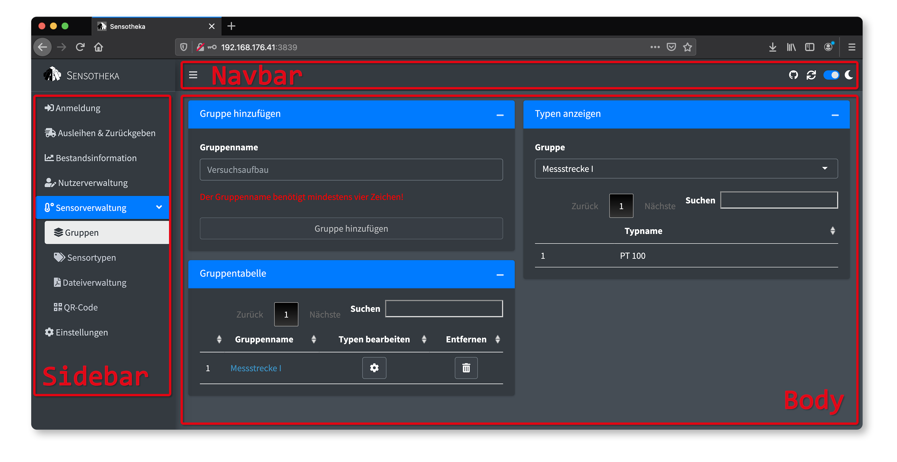
```

Die genannten drei Elemente halten halten dabei wesentliche Bedienelemente bereit. Die Navbar stellt die Orientierungshilfe für den Nutzer dar. Sie ist stets visuell präsent, befindet sich oberhalb des Bodys und ermöglicht beispielsweise das Öffnen weiterer Menüs wie der Sidebar. Die Navbar enthält zudem die folgenden Elemente:

* einen Link zum GitHub-Repository, das den Quellcode der Web-Applikation enthält,
* einen Reload-Button, mit dem eine Aktualisierung der Daten erzwungen werden kann,
* einen Schalter, mit dem zwischen Tag- und Nachtmodus gewechselt werden kann.

Ausgehend von der Navbar kann, sofern nicht bereits geöffnet, das Sidebarmenü mithilfe der links befindlichen Schaltfläche geöffnet werden. In der Sidebar kann über einen Reiter die Funktionalität ausgewählt werden, die im Body dargestellt werden soll. Die Anzahl an Auswahlmöglichkeiten hängt vom Anmeldestatus und der Benutzerrolle ab. Im Folgenden gilt es daher die Reiter der Sidebar im einzelnen näher zu betrachten.

## Anmeldung {#login}

Dieser Reiter verändert sich in Abhängigkeit des Anmeldestatus.

### Status: Nicht angemeldet

Registrierte Benutzer können sich durch Angabe ihres Benutzernamens und ihres Passwortes anmelden, vergleiche Abbildung \@ref(fig:login-mask). Nicht-registrierte Benutzer müssen sich von einem Moderator oder Administrator (Wissenschaftliche Mitarbeiter) registrieren lassen.

```{r login-mask, echo=FALSE, fig.cap="Anmeldung - nicht angemeldet"}
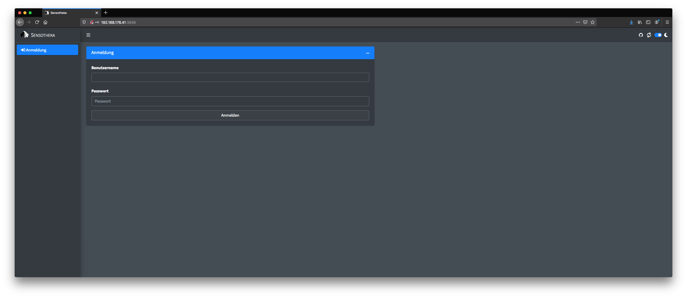
```

### Status: Angemeldet

Nach erfolgreicher Anmeldung wird der Benutzer mit Informationen über sein Nutzungsverhalten versorgt, vergleiche Abbildung \@ref(fig:login-mask-logged). Dargestellt werden:

* der Benutzername und der Benutzerstatus,
* die Dauer seit der momentanen Anmeldung,
* die Dauer seit der letzten Anmeldung,
* die Anzahl der Anmeldungen.

Benutzer können sich zudem abmelden.

```{r login-mask-logged, echo=FALSE, fig.cap="Anmeldung - angemeldet"}
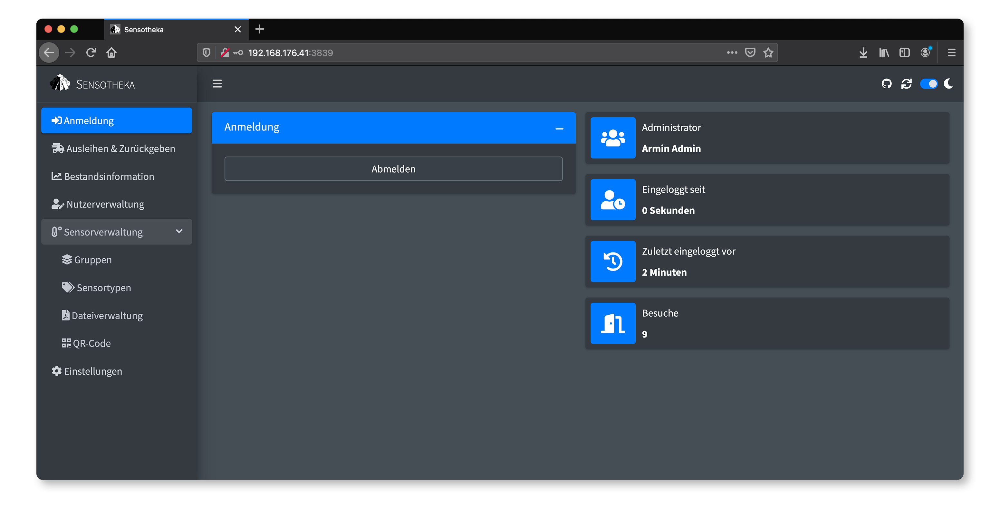
```

## Ausleihen & Zurückgeben {#operate}

Die Ausleihe und Rückgabe setzt sich aus drei Abschnitten zusammen, vergleiche Abbildung \@ref(fig:operate-overview). Im ersten Abschnitt *Ausleihen & Zurückgeben* kann die konkrete Operation vorgenommen werden. Zusätzliche Informationen stellen die Abschnitte *Gruppen des ausgewählten Typs* und *Dateien* bereit.

```{r operate-overview, echo=FALSE, fig.cap="Übersicht: Ausleihen & Zurückgeben"}
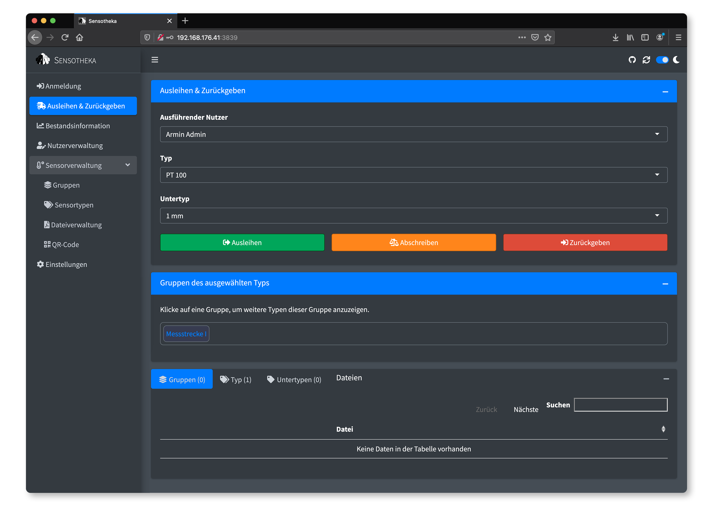
```

### Ausleihen & Zurückgeben

Zunächst muss ein Typ ausgewählt werden. Wenn die Web-Applikation über einen QR-Code aufgerufen wurde (siehe [QR-Code](#qrcode)), ist der zum QR-Code gehörende Typ bereits ausgewählt. Im nächsten Schritt muss ein zugehöriger Untertyp ausgewählt werden. Die konkrete Operation kann durch Klicken auf einen der verfügbaren Buttons angestoßen werden. Im sich darauf öffnenden Dialog muss die Menge angegeben und die Ausführung der Operation bestätigt werden. Abbildung \@ref(fig:operate-detail-circulate) gibt einen Überblick über den Abschnitt.

```{r operate-detail-circulate, echo=FALSE, fig.cap="Abschnitt: Ausleihen & Zurückgeben"}
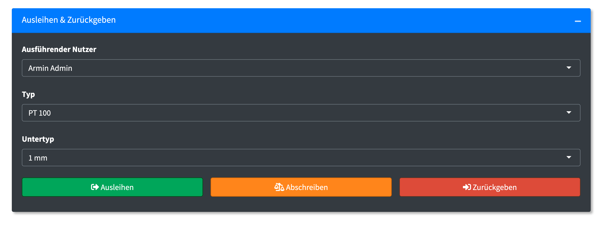
```

Die grundlegenden Schaltflächen Ausleihen sowie Zurückgeben, stehen dabei allen Benutzerrollen zur Verfügung. 

<div class="flex">
`r operate_button("borrow")` Es können bis zur maximal verfügbaren Menge Elemente ausgeliehen werden.
</div>

<div class="flex">
`r operate_button("return")` Es können bis zur maximal ausgeliehenen Menge Elemente zurückgegeben werden.
</div>

Adminstatoren haben in Ergänzung dazu noch die folgenden Befugnisse.

<div class="flex">
`r operate_button("write-off")` `r badge("admin", short = TRUE)` Es können bis zur maximal im Lager verfügbaren Menge Elemente abgeschrieben werden. Dies ist zum Beispiel notwendig, wenn ein Element ausfällt oder verloren geht.
</div>

`r badge("admin", short = TRUE)` Administratoren können zusätzlich den ausführenden Nutzer auswählen, um Operationen für diesen durchzuführen. Das könnte zum Beispiel notwendig sein, wenn ein Student das Fachgebiet verlassen hat und es versäumt hat, alle ausgeliehenen Sensoren in der Web-Applikation zurückzugeben.

### Gruppen des ausgewählten Typs

Alle Gruppen des ausgewählten Typs werden aufgelistet. Durch Klicken auf eine Gruppe öffnet sich ein Dialog, in dem alle Typen dieser Gruppe angezeigt werden, vergleiche Abbildung \@ref(fig:operate-detail-groups). Durch Klicken auf einen Typen wird dieser Typ für eine weitere Operation ausgewählt. Somit können alle Elemente einer Gruppe (zum Beispiel ein Versuchsaufbau) komfortabel hintereinander ausgeliehen / zurückgegeben werden.

```{r operate-detail-groups, echo=FALSE, fig.cap="Abschnitt: Gruppen des ausgewählten Typs"}
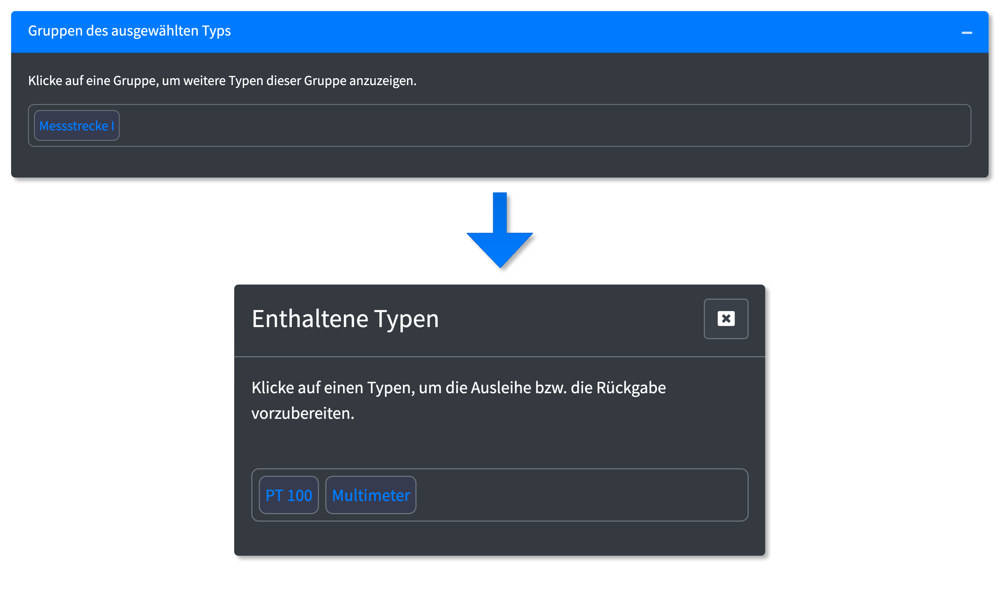
```

### Dateien

Hier werden alle dem ausgewählten Typ zugeordneten Dateien angezeigt. Dabei ist die Anzeige - wie Abbildung \@ref(fig:operate-detail-files) entnommen werden kann - in drei Reiter gegliedert:

* *Gruppen*: Alle Dateien, die Informationen zu Gruppen des ausgewählten Typs enthalten
* *Typ*: Alle Dateien, die Informationen zum ausgewählten Typ enthalten
* *Untertypen*: Alle Dateien, die Informationen zu Untertypen des ausgewählten Typs enthalten. Es ist zu beachten, dass die Wahl des Untertypen keinen Einfluss auf die angezeigten Dateien hat, da Dateien für alle Untertypen dargestellt werden.

Die Ziffer neben dem Reitertitel gibt Auskunft darüber, wie viele Dateien in der jeweiligen Kategorie vorhanden sind. Indem auf einen Dateinamen geklickt wird, öffnet sich das zugehörige PDF in einem separaten Browserfenster oder wird über den PDF-Viewer angezeigt. Alle Dateien einer Kategorie können in einem Archiv (*.zip*) heruntergeladen werden.

```{r operate-detail-files, echo=FALSE, fig.cap="Abschnitt: Dateien"}
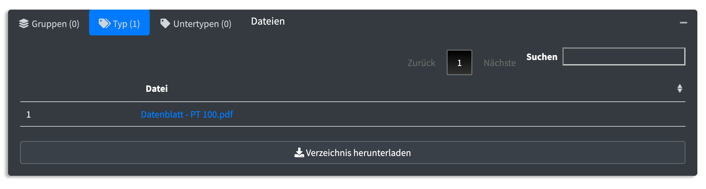
```

## Bestandsinformation {#reporting}

Die Bestandsinformation gliedert sich in zwei Abschnitte, vergleiche Abbildung \@ref(fig:reporting-overview). In der Bestandsübersicht werden Informationen zum Lagerbestand von Sensoren dargestellt, wohingegen die Ausleihübersicht Informationen über ausgeliehene Sensoren enthält.

```{r reporting-overview, echo=FALSE, fig.cap="Übersicht: Bestandsinformation"}
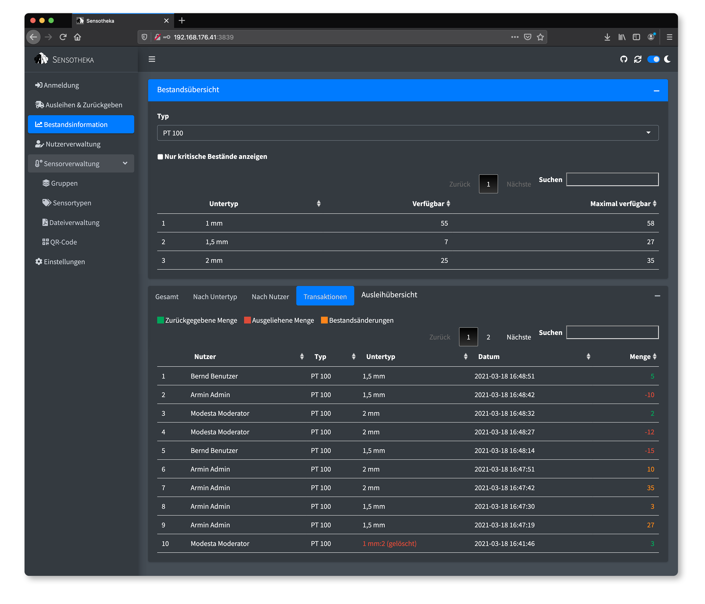
```

### Bestandsübersicht

Zunächst muss ein Typ ausgewählt werden. Für diesen Typen werden tabellarisch alle Untertypen dieses Typs aufgelistet. Die Spalte *Verfügbar* enthält die gelagerte Menge, wohingegen die Spalte *Maximal verfügbar* die maximal gelagerte Menge (kein Sensor dieses Untertypen ausgeliehen) enthält. Über die Checkbox *Nur kritische Bestände anzeigen* kann ausgewählt werden, ob nur Untertypen angezeigt werden sollen, für die die verfügbare Menge kleiner als der definierte kritische Bestand ist. Der kritische Bestand eines Untertypen kann von einem `r badge("admin")` im Reiter [Sensortypen](#type) festgelegt werden.

### Ausleihübersicht

Die Ausleihübersicht besteht aus vier Reitern, die unterschiedliche Fragestellungen in Bezug auf ausgeliehene Sensoren beantworten, vergleiche Tabelle \@ref(tab:reporting-details) und Abbildung \@ref(fig:reporting-details).

| Reiter | Beschreibung |
| --- | ------ |
| Gesamt | Übersicht über alle Untertypen mit einer gegenwärtig ausgeliehenen Menge größer Null. |
| Nach Untertyp | Übersicht über alle Nutzer, die den gewählten Untertypen zurzeit ausgeliehen haben. Hiermit kann herausgefunden werden, wer Ansprechpartner ist, falls alle Elemente eines Untertyps ausgeliehen sind. |
| Nach Nutzer | Übersicht über alle Untertypen, die der gewählte Nutzer zurzeit ausgeliehen hat. |
| Transaktionen | Übersicht über alle Transaktionen, die jemals im Rahmen der Sensorverwaltung stattgefunden haben. Ein Nutzer sieht ausschließlich seine eigenen Transaktionen. Ein `r badge("admin")` sieht alle Transaktionen. Dazu gehören neben Ausleih- und Rückgabeoperationen auch Abschreibungen und sonstige Mengenänderungen. |

Table: (\#tab:reporting-details) Übersicht über die Ausleihübersicht

```{r reporting-details, echo=FALSE, fig.cap="Übersicht: Ausleihübersicht"}
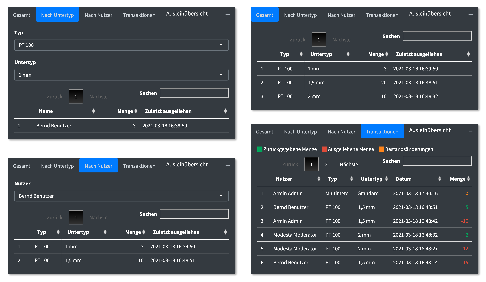
```

## Nutzerverwaltung `r badge("admin", short = TRUE)` `r badge("mod", short = TRUE)` {#user-management}

In der *Nutzerverwaltung* können neue Nutzer hinzugefügt und in der *Nutzertabelle* verwaltet werden, vergleiche Abbildung \@ref(fig:user-management-overview).

```{r user-management-overview, echo=FALSE, fig.cap="Übersicht: Nutzerverwaltung"}
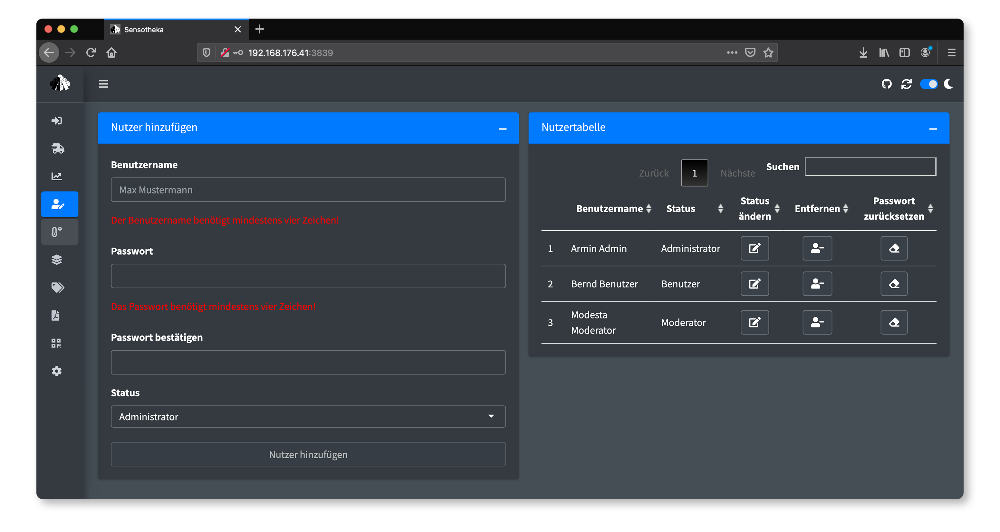
```

### Nutzer hinzufügen

Neue Nutzer können unter Angabe eines Benutzernamens und eines zur Sicherheit zweimal anzugebenden Passwortes hinzugefügt werden. Ein `r badge("mod")` kann ausschließlich `r badge("user")` hinzufügen, wohingegen ein `r badge("admin")` Benutzer mit jeder Rolle hinzufügen kann.

### Nutzertabelle

In der Nutzertabelle (vergleiche Tabelle \@ref(tab:user-table)) können Nutzer verwaltet werden. Neben dem Benutzernamen und dem gegenwärtigen Status gibt es drei Spalten, die Buttons enthalten, mit denen Eigenschaften eines Nutzer angepasst werden können.

| Spalte | Beschreibung |
| --- | ------ |
| Status ändern `r badge("admin", short = TRUE)` | Dieser Button öffnet einen Dialog, in dem ein neuer Status für den Nutzer ausgewählt werden kann. |
| Entfernen | Dieser Button öffnet einen Dialog, in dem bestätigt werden muss, dass der ausgewählte Nutzer gelöscht werden soll. Es ist zu beachten, dass diese Operation nicht rückgängig gemacht werden kann. Transaktionen, die der ausgewählte Nutzer vorgenommen hat, bleiben jedoch weiterhin erhalten. Es können nur Nutzer gelöscht werden, die zurzeit keine Sensoren ausgeliehen haben. Falls der Nutzer nicht in der Lage ist, die Sensoren eigenständig zurückzugeben, kann der `r badge("admin")` die ausgeliehenen Sensoren im Reiter [Ausleihen & Zurückgeben](#operate) für diesen Nutzer zurückgeben. Ein `r badge("mod")` kann nur `r badge("user")` entfernen, die er selbst hinzugefügt hat. |
| Passwort zurücksetzen `r badge("admin", short = TRUE)` | Dieser Button öffnet einen Dialog, in dem bestätigt werden muss, dass das Passwort des Nutzers zurückgesetzt werden soll. Das Passwort wird auf das Standardpasswort *1234* zurückgesetzt und sollte vom Nutzer sofort danach im Reiter [Einstellungen](#settings) geändert werden. |

Table: (\#tab:user-table) Nutzertabelle

## Gruppen `r badge("admin", short = TRUE)` {#group}

Der Reiter *Gruppen* erlaubt es, neue Gruppen hinzuzufügen und bestehende Gruppen zu verwalten, vergleiche Abbildung \@ref(fig:group-overview).

```{r group-overview, echo=FALSE, fig.cap="Übersicht: Gruppen"}
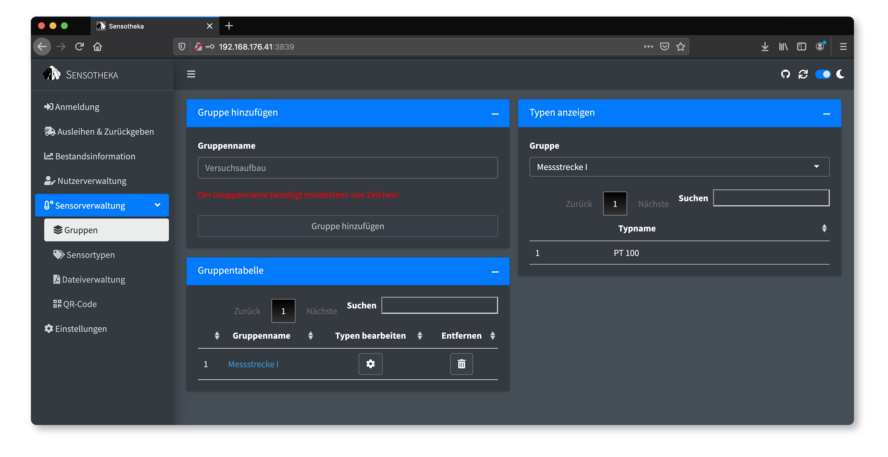
```

### Gruppe hinzufügen

Eine neue Gruppe kann durch Angabe eines Gruppennamens hinzugefügt werden.

### Gruppentabelle

In der *Gruppentabelle* (vergleiche Tabelle \@ref(tab:group-table)) können Gruppen bearbeitet werden.

| Spalte | Beschreibung |
| --- | ------ |
| Gruppenname | Ein Klick auf einen Gruppennamen öffnet einen Dialog, in dem der Gruppenname angepasst werden kann. |
| Typen bearbeiten | Dieser Button öffnet einen Dialog, in dem die zur ausgewählten Gruppe zugehörigen Typen bearbeitet werden können. |
| Entfernen | Dieser Button öffnet einen Dialog, in dem bestätigt werden muss, dass die ausgewählte Gruppe gelöscht werden soll. Es ist zu beachten, dass diese Operation nicht rückgängig gemacht werden kann. |

Table: (\#tab:group-table) Gruppentabelle

### Typen anzeigen

Zunächst muss eine Gruppe ausgewählt werden. In der Tabelle werden alle zur ausgewählten Gruppe zugehörigen Typen dargestellt.

## Sensortypen `r badge("admin", short = TRUE)` {#type}

Der Reiter *Sensortypen* erlaubt es, neue Typen und Untertypen hinzuzufügen und bestehende Typen und Untertypen zu verwalten, vergleiche Abbildung \@ref(fig:type-overview).

```{r type-overview, echo=FALSE, fig.cap="Übersicht: Sensortypen"}
knitr::include_graphics("./img/type_overview.png")
```

### Typ hinzufügen

Ein neuer Typ kann durch Angabe eines Typnamens hinzugefügt werden.

### Typtabelle

In der *Typtabelle* (vergleiche Tabelle \@ref(tab:type-table)) können Typen bearbeitet werden.

| Spalte | Beschreibung |
| --- | ------ |
| Typname | Ein Klick auf einen Typnamen öffnet einen Dialog, in dem der Typname angepasst werden kann. |
| Gruppen bearbeiten | Dieser Button öffnet einen Dialog, in dem die zum ausgewählten Typ zugehörigen Gruppen bearbeitet werden können. |
| Entfernen | Dieser Button öffnet einen Dialog, in dem bestätigt werden muss, dass der ausgewählte Typ gelöscht werden soll. Es ist zu beachten, dass diese Operation nicht rückgängig gemacht werden kann. Ein Typ kann nur gelöscht werden, wenn kein Element seiner Untertypen ausgeliehen ist. Transaktionen, die den ausgewählten Typen betreffen, bleiben weiterhin erhalten. Das Entfernen eines Typen schließt das Entfernen aller Untertypen dieses Typen ein. |

Table: (\#tab:type-table) Typtabelle

### Gruppen anzeigen

Zunächst muss ein Typ ausgewählt werden. In der Tabelle werden alle zum ausgewählten Typen zugehörigen Gruppen dargestellt.

### Untertypen bearbeiten

Zunächst muss ein Typ ausgewählt werden. In der *Untertypentabelle* (vergleiche Tabelle \@ref(tab:subtype-table)) können Untertypen des ausgewählten Typen bearbeitet werden.

| Spalte | Beschreibung |
| --- | ------ |
| Untertypname | Ein Klick auf einen Untertypnamen öffnet einen Dialog, in dem der Untertypname angepasst werden kann. |
| Menge | Ein Klick auf die maximal verfügbare Menge öffnet einen Dialog, in dem die maximal verfügbare Menge des Untertypen angepasst werden kann. Es ist zu beachten, dass die maximal verfügbare Menge nicht auf einen Wert gesetzt werden kann, der kleiner der Anzahl gegenwärtig ausgeliehener Elemente ist. |
| Kritischer Bestand | Ein Klick auf den kritischen Bestand öffnet einen Dialog, in dem der kritische Bestand des Untertypen angepasst werden kann. Der kritische Bestand kann als Filterkriterium in der *Ausleihübersicht* des Reiters [Bestandsinformation](#reporting) verwendet werden. |
| Entfernen | Dieser Button öffnet einen Dialog, in dem bestätigt werden muss, dass der ausgewählte Untertyp gelöscht werden soll. Es ist zu beachten, dass diese Operation nicht rückgängig gemacht werden kann. Ein Untertyp kann nur gelöscht werden, wenn keine Elemente von diesem ausgeliehen sind. Transaktionen, die den ausgewählten Untertypen betreffen, bleiben weiterhin erhalten. |

Table: (\#tab:subtype-table) Untertypentabelle

## Dateiverwaltung `r badge("admin", short = TRUE)` {#file-management}

In der *Dateiverwaltung* können PDF-Dateien als Informationsmaterial in den Reitern *Gruppen*, *Typen* und *Untertypen* hochgeladen werden, siehe Abbildung \ref(fig:filemanagement_overview).

```{r reporting-details, echo=FALSE, fig.cap="Übersicht: Ausleihübersicht"}

```

Die Reiter unterscheiden sich ausschließlich in der Auswahl des zu beschreibenden Objektes. Durch Klick auf *Datei hochladen* kann eine PDF-Datei auf dem lokalen Dateisystem ausgewählt werden. Hochgeladene Dateien werden in einer Tabelle (vergleiche Tabelle \@ref(tab:file-table)) angezeigt.

| Spalte | Beschreibung |
| --- | ------ |
| Datei | Ein Klick auf einen Dateinamen öffnet einen Dialog, in dem der Dateiname angepasst werden kann. |
| Herunterladen | Dieser Button lädt die Datei herunter. |
| Löschen | Dieser Button öffnet einen Dialog, in dem bestätigt werden muss, dass die ausgewählte Datei gelöscht werden soll. Es ist zu beachten, dass diese Operation nicht rückgängig gemacht werden kann. | 

Table: (\#tab:file-table) Dateitabelle

## QR-Code `r badge("admin", short = TRUE)` {#qrcode}

Zur beschleunigten Ausleihe und Rückgabe kann ein QR-Code für Typen erstellt werden, vergleiche Abbildung \@ref(fig:qr-code-overview). Dazu muss zunächst der Typ und die Serverdomäne ausgewählt werden. Der erstellte QR-Code und der Link, auf den der QR-Code verweist, werden eingeblendet. Der QR-Code kann im Anschluss als PDF-, PNG- oder SVG-Datei heruntergeladen werden. Dazu kann zusätzlich die Breite und Höhe der zu erstellenden Datei in Millimetern angegeben werden.

Der ausgedruckte QR-Code kann im Lager platziert werden. Dort muss er zum Beispiel mit einem auf einem mobilen Endgerät installierten, handelsüblichen QR-Code-Reader eingescannt werden, wodurch die Web-Applikation geöffnet wird. `r badge("user")` und `r badge("mod")` werden - falls bereits angemeldet, siehe [Cookies](#cookies) - sofort, ansonsten nachdem sie sich angemeldet haben, auf den Reiter [Ausleihen & Zurückgeben](#operate) weitergeleitet, wo der eingescannte Typ bereits vorausgewählt ist. Es muss dann nur noch der Untertyp ausgewählt werden.

```{r qr-code-overview, echo=FALSE, fig.cap="Übersicht: QR-Code"}
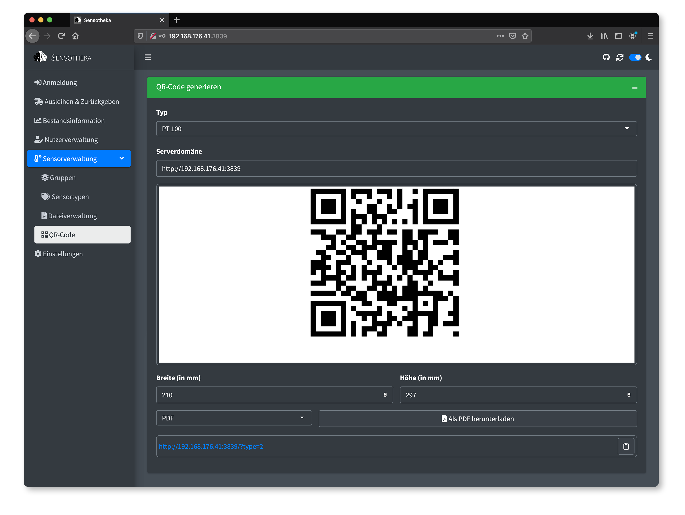
```

## Einstellungen {#settings}

In den Einstellungen können der Benutzername und das Passwort geändert werden, vergleiche Abbildung \@ref(fig:settings-overview).

```{r settings-overview, echo=FALSE, fig.cap="Übersicht: Einstellungen"}
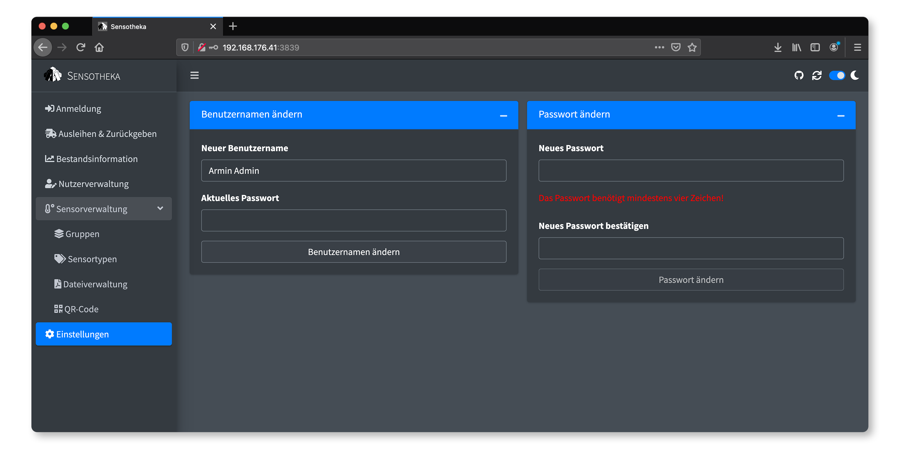
```

### Benutzernamen ändern

Um den eigenen Benutzernamen zu ändern, muss ein neuer Benutzername eingeben werden. Nach Eingabe des Passworts und Bestätigen wird der Benutzername geändert.

### Passwort ändern

Um das eigene Passwort zu ändern, muss ein neues Passwort zweimal eingegeben und bestätigt werden.

<!--chapter:end:05-user-guide.Rmd-->

# Technische Umsetzung {#technical-guide}

Die nachfolgenden Abschnitte erweitern die Nutzerhilfe um die Beschreibung der technischen Umsetzung ausgewählter Elemente der Web-Applikation. Die ausgewählten Elemente sollen dabei insbesondere eine Vielzahl des verwendeteten Methodenspektrums darlegen, sodass eine nachhaltige Nutzung über die Laufzeit des Projektes hinaus erleichtert wird. Darüber hinaus sollen interessante Ansätze vorgestellt werden.

## Struktur der Web-Applikation

Strukturell handelt es sich bei der Web-Applikation um eine Sammlung verschiedener Dateien innerhalb eines Ordners. Der Einstiegspunkt in die Web-Applikation ist die Datei `app.R`. Alle anderen Dateien werden zur Laufzeit der Web-Applikation eingebunden. Die Web-Applikation wird gestartet, indem der Shiny Server die Datei `app.R` ausführt. In `app.R` werden Initialisierungen durchgeführt und die Funktionen `ui` und `server` definiert. Die Datei endet mit dem Aufruf `shinyApp(ui, server)`, wobei die `ui`-Funktion das visuelle Layout der Web-Applikation beschreibt und die `server`-Funktion Eingaben verarbeitet. Mithilfe von sogenannten Modulen kann der Code strukturiert werden. Jedes Modul setzt sich dabei wiederum aus einer `ui`- und einer `server`-Funktion zusammen. Module bilden Teilaspekte, die unter Umständen wiederverwendet werden können, ab. [@shiny-modules]

### Struktur von `app.R`

Wie bereits beschrieben, ist die Datei `app.R` der Einstiegspunkt der Web-Applikation. Da sie Einfluss auf das Verhalten vieler weiterer Module hat, ist ihr Aufbau näher zu betrachten. Zur Übersicht werden die Inhalte verkürzt dargestellt.

* Laden benötigter Packages mit `library()`. Die Mehrzahl aller Packages wird über den `::`-Operator referenziert. Nur die Packages, die zwangsläufig mit `library()` geladen werden müssen, also Packages, die funktionsrelevanten Code mit dem Aufruf von `library()` verbinden, werden hier geladen.

```{r, eval=FALSE}
library(shiny)
library(shinyjs)
library(dplyr)
library(qrcode)
```

* Die Funktion `source_directory()` wird manuell geladen und danach dazu verwendet, alle `.R`-Dateien in den Ordnern `modules` und `db/func` zu einzubinden.

```{r, eval=FALSE}
source("init/source_directory.R")

source_directory(
    path = "modules",
    encoding = "UTF-8",
    modifiedOnly = FALSE,
    chdir = TRUE,
    recursive = TRUE,
    envir = if (source_to_globalenv) globalenv() else environment()
)
```

* Die `ui`-Funktion bindet alle CSS- und JavaScript-Dateien ein und aktiviert spezielle Packages. Die Funktion `container_ui()`, die das Layout des Dashboardes festlegt, wird aufgerufen. In `container_ui()` wird für jeden Reiter eine eigene `ui`-Funktion aufgerufen.

```{r, eval=FALSE}
    # UI -----------------------------------------------------------------------
    ui <- htmltools::tagList(
        htmltools::includeScript("www/js/dark-mode.js"),
        htmltools::includeCSS("www/css/styles.css")
        container_ui(
            id = "container"
        ),
        rclipboard::rclipboardSetup(),
        shinyjs::useShinyjs(),
        waiter::use_waiter()
    )
```

* In der `server`-Funktion wird die `.values`-[Environment](https://adv-r.hadley.nz/environments.html) angelegt. Diese enthält die in Tabelle \@ref(tab:values-environment) aufgelisteten Elemente.

| Name | Beschreibung |
| --- | ------ |
| `query$type` | Aus Query-String ausgelesene Typ-ID |
| `settings` | Liste, die Namenslängen festlegt und Dictionaries enthält |
| `update` | Liste, die `reactiveVal()`s enthält, die bei Datenaktualisierung getriggert werden |
| `user` | Liste, die Informationen zum angemeldeten Nutzer enthält |
| `yaml` | Inhalt von `app.yml` |

Table: (\#tab:values-environment) Die `.values`-Environment

Diese Environment wird jeder `server`-Funktion übergeben, sodass die Werte in jeder `server`-Funktion verfügbar sind.

* In der `server`-Funktion von `app.R` wird die `server`-Funktion `container_server()` aufgerufen.

### Ordnerstruktur

* `.gitignore` Index aller Dateien, die nicht der Versionskontrolle unterliegen
* `app.R` Einstiegspunkt in die Web-Applikation
* `app.yml` Konfigurationsdatei
* `db`
  * `db.sqlite` Datenbank
  * `func` Funktionssammlung zur Interaktion mit der Datenbank
* `files` Dateiensammlung für [Dateiverwaltung](#file-management). Enthält drei Unterordner für Gruppen, Typen und Untertypen. Jeder dieser Unterordner enthält für jedes Element der jeweiligen Kategorie einen Ordner mit der Identifikationsnummer des jeweiligen Elementes als Namen
* `init/source_directory.R` Hilfsfunktion, die beim Start der Web-Applikation alle `.R`-Dateien einliest
* `modules` Shiny-Module und sonstige Funktionalitäten
  * `container.R` Definition des Dashboards
  * `dt_options.R` Optionen für `DT::datatable`
  * `object` Generalisierte Module für Gruppen, Typen und Untertypen (z.B. Element hinzufügen, umbenennen etc.)
  * `sidebar_menu.R` Definition der Sidebar
  * `tab_file_management` [Dateiverwaltung](#file-management)
  * `tab_group` [Gruppen](#groups)
  * `tab_login` [Anmeldung](#login)
  * `tab_operate` [Ausleihen & Zurückgeben](#operate)
  * `tab_qrcode` [QR-Code](#qrcode)
  * `tab_reporting` [Bestandsinformation](#reporting)
  * `tab_settings` [Einstellungen](#settings)
  * `tab_type` [Typen](#type)
  * `tab_user_management` [Nutzerverwaltung](#user-management)
  * `utils.R` Hilfsfunktionen
* `renv`, `renv.lock` Package-Management
* `www`
  * `css` CSS-Dateien
  * `favicon.ico` Sensotheka-Icon
  * `js` JavaScript-Dateien

## Datenbank {#database}

Die Datenbank ist eine SQLite-Datenbank. Sie liegt in `db/db.sqlite`. Der Zugriff erfolgt über das Package {DBI} [@R-DBI].

### Struktur

Alle Tabellen enthalten die Spalte `rowid`, die den Primärschlüssel der jeweiligen Tabelle enthält. Diese kann somit zur eindeutigen Identifikation einer Zeile verwendet werden. Die Beschränkung `r badge("unique")` bezieht sich immer nur auf die nicht gelöschten Elemente (`removed = 0`).

#### circulation

| Spalte | Einschränkungen | Beschreibung |
|:------ |:------ |:------------ |
| user_id | `r badge("fk")` | Identifikationsnummer des ausführenden Nutzers |
| subtype_id | `r badge("fk")` | Identifikationsnummer des bearbeiteten Untertyps |
| quantity | `r badge("nn")` | Bearbeitete Menge |
| time | | Zeitpunkt der Transaktion |
| op_type | `1` oder `2` | Transaktionsart: `1` - Ausleihen und Zurückgeben, `2` - Bestandsänderungen |

Table: (\#tab:circulation) Datenbank: Tabelle `circulation`

#### groups

| Spalte | Einschränkungen | Beschreibung |
|:------ |:------ |:------------ |
| group_name | `r badge("unique")` | Gruppenname |
| removed | `0` oder `1` | `0` - existent, `1` - gelöscht |

Table: (\#tab:groups) Datenbank: Tabelle `groups`

#### group_type

| Spalte | Einschränkungen | Beschreibung |
|:------ |:------ |:------------ |
| group_id | `r badge("fk")` | Identifikationsnummer der Gruppe |
| type_id | `r badge("fk")` | Identifikationsnummer des Typs |

Table: (\#tab:group-type) Datenbank: Tabelle `group_type`

#### subtype

| Spalte | Einschränkungen | Beschreibung |
|:------ |:------ |:------------ |
| type_id | `r badge("fk")` | Identifikationsnummer des Typs |
| subtype_name | `r badge("unique")` innerhalb eines Typs | Untertypenname |
| quantity | `r badge("nn")` | Bestandsmenge |
| removed | `0` oder `1` | `0` - existent, `1` - gelöscht |

Table: (\#tab:subtype) Datenbank: Tabelle `subtype`

#### type

| Spalte | Einschränkungen | Beschreibung |
|:------ |:------ |:------------ |
| type_name | `r badge("unique")` | Typname |
| removed | `0` oder `1` | `0` - existent, `1` - gelöscht |

Table: (\#tab:type) Datenbank: Tabelle `type`

#### user

| Spalte | Einschränkungen | Beschreibung |
|:------ |:------ |:------------ |
| hash | | Verhashter Nutzername (notwendig für Cookies) |
| name | `r badge("unique")` | Nutzername |
| status | `admin`, `mod` oder `user` | Nutzerrolle |
| password | | Verhashtes Passwort |
| added_from | | Nutzeridentifikationsnummer des Hinzufügenden |
| time_added | | Zeitpunkt der Kontoeröffnung |
| time_current_logged | | Zeitpunkt der letzten Anmeldung |
| time_previous_logged | | Zeitpunkt der vorletzten Anmeldung |
| times_logged | | Anzahl der Anmeldungen |
| removed | `0` oder `1` | `0` - existent, `1` - gelöscht |

Table: (\#tab:user) Datenbank: Tabelle `user`

### Zugriff

```{r, echo=FALSE}
wd <- getwd()
knitr::opts_knit$set(root.dir = "./../App")
```

```{r}
library(DBI)
library(RSQLite)

# Verbinde die Datenbank mit R
db <- dbConnect(SQLite(), "db/db.sqlite")

# Tabellennamen
dbListTables(db)
```

Beispielhaft wird die Tabelle "circulation" betrachtet. Diese Tabelle speichert alle Transaktionen, die von Nutzern durchgeführt worden sind, also zum Beispiel Ausleihen, Rückgaben und Mengenänderungen.

```{r, eval=FALSE}
dbReadTable(db, "circulation")
```

```{r, echo=FALSE}
tbl <- dbReadTable(db, "circulation")
kableExtra::kbl(tbl[1:10,], booktabs = TRUE, caption = "Beispielhafter Inhalt der Tabelle `circulation`") %>%
  kableExtra::kable_styling(full_width = TRUE) %>%
  kableExtra::column_spec(4, "5cm")
```

Der Ordner `db/func` enthält eine Sammlung von über 80 Hilfsfunktionen, die zum Erstellen, Abfragen und Modifizieren der Datenbank verwendet werden. Die Interaktion mit der Datenbank erfolgt ausschließlich über diese Hilfsfunktionen. Dadurch werden Redundanzen ausgeschlossen und es ist darüber hinaus einfacher, die korrekte Funktionalität zu gewährleisten.

Beispielhaft wird die Funktion `db_get_borrowed_quantity(db, subtype_id)` betrachtet. Unter Angabe der Datenbank `db` und einer oder mehrerer Untertypenidentifikationsnummern `subtype_id` wird die ausgeliehene Menge dieser Untertypen zurückgegeben. In {DBI} werden Abfragen an die Datenbank mithilfe von `dbGetQuery()` gestellt. Das Resultat der Abfrage wird anschließend weiterverarbeitet. Der Nutzen der Hilfsfunktion wird zusätzlich dadurch verdeutlicht, dass sowohl die abzufragende Tabelle sowie die beteiligten Zeilen und Spalten nicht gesondert angegeben werden müssen. 

```{r}
# Funktionsdefinition
db_get_borrowed_quantity <- function(db, subtype_id) {
  borrowed <- DBI::dbGetQuery(
    db,
    "SELECT SUM(quantity) AS borrowed FROM circulation
    WHERE subtype_id = ? AND op_type = 1",
    params = list(subtype_id)
  )$borrowed

  ifelse(is.na(borrowed), 0, borrowed)
}

# Abfrage der ausgeliehenen Menge für mehrere Untertypen
db_get_borrowed_quantity(db, 1:5)
```

```{r, echo=FALSE}
knitr::opts_knit$set(root.dir = wd)
```

## Cookies {#cookies}

Cookies sind Textdaten, die der Client mit jeder Anfrage an den Server mitsendet [@cookies]. Die Web-Applikation setzt zwei Cookies. Die Cookies sind jeweils für einen Zeitraum von sieben Tagen gültig.

### dark-mode

Dieses Cookie kann die Werte `"true"` oder `"false"` enthalten. Das Cookie wird gesetzt, wenn der Nutzer den Schalter für den Nachtmodus verwendet. Beim Start der Web-Applikation wird das Cookie verwendet, um den initialen Status für den Nachtmodus zu bestimmen. Falls das Cookie nicht vorhanden ist, wird die Einstellung des Browsers (`window.matchMedia('(prefers-color-scheme: dark)')`) ausgelesen und im Cookie gesetzt.

### user

Dieses Cookie enthält einen verhashten Nutzernamen und dient zur Identifikation eines angemeldeten Nutzers. Das Cookie wird gesetzt, wenn sich ein Nutzer anmeldet. Beim Start der Web-Applikation wird das Cookie verwendet, um den Nutzer automatisch anzumelden. Falls das Cookie nicht vorhanden ist, muss der Nutzer sich manuell anmelden.

### Implementierung

Zur Verwaltung der Cookies wird die Bibliothek [js-cookie](https://github.com/js-cookie/js-cookie) [@js-cookie] verwendet. Die Datei `www/js/cookies.js` enthält Hilfsfunktionen zum Lesen und Schreiben von Cookies und verbindet diese mit Inputwerten in Shiny. Die Hilfsfunktionen werden in R mithilfe von `shinyjs::extendShinyjs()` eingebunden.

## Deployment

Der Shiny Server liegt auf einer virtuellen Maschine (VirtualBox). Auf der virtuellen Maschine ist das Betriebssystem *Ubuntu 20.04.2 LTS* ohne grafische Benutzeroberfläche installiert. Änderungen am Shiny Server werden erst wirksam, nachdem der Shiny Server neugestartet wurde. Dazu kann folgender Befehl verwendet werden: `sudo systemctl restart shiny-server`.

Nachfolgend wird auf Ordner verwiesen, in denen für die Web-Applikation relevante Dateien liegen.

* `/etc/shiny-server`

  Dieser Ordner enthält die Datei `shiny-server.conf`, mit der der Shiny Server konfiguriert werden kann [@shiny-server]. Hier kann der Port eingestellt werden, unter dem die Web-Applikation verfügbar gemacht wird. Der Port `3838` ist voreingestellt.

<br>

* `/srv/shiny-server/Sensotheka`
  
  Dieser Ordner enthält das Git-Repository, das die tatsächliche Web-Applikation darstellt. Es verweist auf das GitHub-Repository `https://github.com/PFA-WebApp/App.git` als Remote mit Namen `origin`. In der Datei `app.yml` müssen die in Tabelle \@ref(tab:app-yml) aufgelisteten Einstellungen vorgenommen werden:
  
  | Einstellung | Beschreibung |
| :--- | :--------- |
| showcase | `yes` für Showcasemodus (Passwörter für Standardnutzer werden eingeblendet, Standardnutzer können nicht gelöscht werden), `no` (voreingestellt) für Betriebsmodus |
| url | Basis-URL auf welche QR-Codes verweisen (hier sind Anpassungen zwingend notwendig) |

  Table: (\#tab:app-yml) Einstellungen in `app.yml`

<br>

* `/etc/rstudio`

  Dieser Ordner enthält die Datei `rserver.conf`, mit der der RStudio Server konfiguriert werden kann [@rstudio-server]. Hier kann der Port eingestellt werden, unter dem der RStudio Server verfügbar gemacht wird. Der Port `8787` ist voreingestellt. Der RStudio Server kann zur nachhaltigen Pflege und Weiterentwicklung der Web-Applikation genutzt werden. Dazu muss der Port aufgerufen werden. In der Login-Maske kann sich mithilfe des Nutzers `pfa` und eines zugehörigen Passworts eingeloggt werden. Danach öffnet sich die Online-Version der Entwicklungsumgebung RStudio, deren Funktionsumfang mit dem der Desktopversion identisch ist.
  
  Für weitere Informationen siehe [https://docs.rstudio.com/ide/server-pro/](https://docs.rstudio.com/ide/server-pro/). Es ist zu beachten, dass es sich bei der installierten Version um die Open-Source-Version und *nicht* um die Pro-Version handelt.

<br>

* `/var/log/shiny-server/Sensotheka`

  Dieser Ordner enthält Log-Dateien, die vom Shiny Server erzeugt werden, wenn Komplikationen im Betrieb auftreten. Sollte das der Fall sein, ist es ratsam, diese zunächst zu konsultieren, bevor mit der Fehlerbehandlung begonnen wird.

<!--chapter:end:06-technical-guide.Rmd-->

# Diskussion und Ausblick {#discussion}

Das Projekt wird mit einer Diskussion der Ergebnisse abgeschlossen. Dabei wird auch thematisiert, wie diese Ergebnisse erzielt wurden.
Übergeordnetes Ziel des Projektes war es, eine Web-Applikation zu entwickeln, die die Sensorverwaltung des Fachgebietes Fahrzeugantriebe der Technischen Universität Berlin übernimmt. Dazu musste eine Vielzahl von Konzepten erstellt und umgesetzt werden, unter anderem die Abstraktion der Datenstruktur und deren Abbildung auf eine Datenbank. Die an die Web-Applikation nach Aufgabenstellung gestellten Anforderungen wurden allesamt erfüllt und konnten in Rücksprache mit den Ansprechpartnern am Fachgebiet sogar erweitert werden. 

Rückblickend ist festzuhalten, dass der Umfang des Projektes - insbesondere durch zusätzliche Anforderungen - den verfügbaren zeitlichen Rahmen überstiegen hat. Während der Projektphase sind zusätzliche optionale Anforderungen aufgetreten, die mit einem realistischen Qualitätsanspruch nicht umgesetzt werden konnten. Das Hauptaugenmerk bei der Entwicklung der Web-Applikation lag insbesondere auf der Gewährleistung der Funktionalität über den Rahmen des Projektes hinaus. Diesem Aspekt wurde die Implementierung zusätzlicher Funktionalität geringerer Qualität untergeordnet. Vor allen Dingen wurden das Layout, die Datenbankstruktur und Operationen auf der Datenbank optimiert. Das Layout ist zeitgemäß, konsistent und übersichtlich, sodass der Nutzer sich einfach zurechtfindet. Es überzeugt durch einen hohen Detailgrad. Die Datenbankstruktur ist redundanzfrei und konnte trotz gestiegener Anforderungen über das Projekt zielführend erweitert werden. Eine Vielzahl an Hilfsfunktionen sowie der kohärente Aufbau der Tabellen begünstigt darüber hinaus eine zukünftige Erweiterung auf eine effiziente Weise. Die logische Konsistenz der Daten wird des Weiteren durch den vielfältigen Einsatz von Datenbankbeschränkungen garantiert.

Die Struktur der Web-Applikation begünstigt daher nicht nur ihren zuverlässigen dauerhaften Einsatz sondern auch eine stetige Weiterentwicklung. Darüber hinaus wurde durch die sachgemäße Einrichtung der virtuellen Maschine der Grundstein für Folgeprojekte gelegt. Der Einstieg in das Projekt für mit R und der Entwicklung von Web-Applikationen unerfahrenen Personen ist sicherlich mit Hürden verbunden. Durch den vorliegenden Bericht und die durchdachte Struktur der Web-Applikation soll er jedoch so einfach wie möglich gemacht werden. Folgeprojekte könnten sich zum Beispiel mit den nachfolgenden Inhalten beschäftigen:

* Erweiterung der Datenstruktur um Stücklisten, um komplexere Beziehungen zwischen Elementen abbilden zu können
* E-Mail-Integration für Registrierung, Vergessen des Passworts und Benachrichtigungen
* Hinterlegen zusätzlicher Informationen für die Ausleihe (vorraussichtliches Rückgabedatum, Verwendungszweck etc.)
* Export von Daten
* Einstellen kritischer Bestände auf Nutzerebene
* Integration zusätzlicher fachgebietspezifischer Anwendungen (Kalender, Dateiverwaltung etc.)

Abschließend freuen wir uns, die fertige Web-Applikation dem Fachgebiet zu übergeben und sind gespannt, in welchem Umfang sie in Zukunft eingesetzt und sogar weiterentwickelt wird.

<!--chapter:end:07-diskussion.Rmd-->

\clearpage

\pagenumbering{roman}

\null

\addcontentsline{toc}{section}{Literaturverzeichnis}

`r if (knitr::is_html_output()) '# Literaturverzeichnis {#references}'`

<!--chapter:end:08-referenzen.Rmd-->

